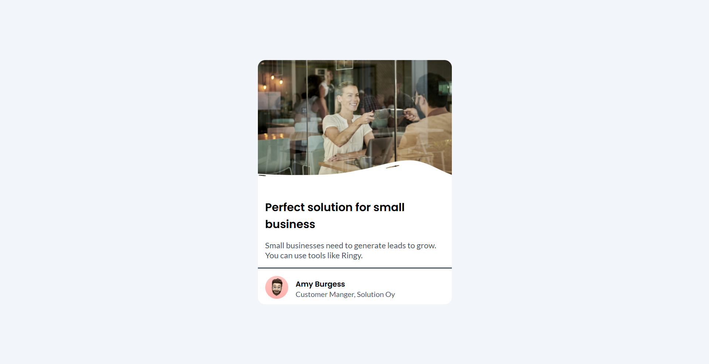
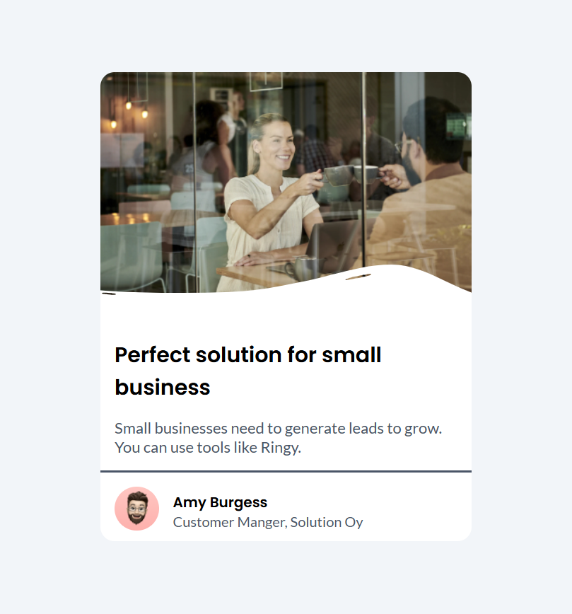
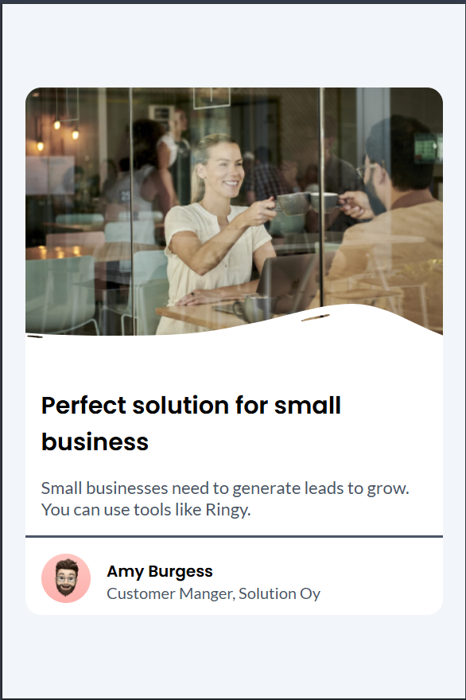

### Imagenes

### What I learned

- **Variables CSS**: Organizar mis estilos reutilizables con variables en `:root`, aunque me quedó la duda si los nombres son semánticos   

- **Responsive Design**: Logré que el card se adapte a móviles usando unidades relativas como `rem`.  

- **Posicionamiento**: Usé `position: relative` en el contenedor para el tag "News", lo cual fue un reto inicial.  

**Feedback request**:  
- ¿Es adecuado el contraste de los textos en `--black-200` contra `--gray-light`?  
- ¿Cómo podría optimizar mi estructura HTML para mejor accesibilidad?  

### Built with

- Semantic HTML5 markup
- CSS custom properties
- Flexbox
- Position
- [Google Fonts](https://fonts.google.com/) - Para la tipografía.  
- [Git](https://git-scm.com/) - Control de versiones.

## Features

- **Diseño responsive**: Se adapta a móviles, tablets y desktop.  
- **Accesibilidad**: Uso de HTML semántico y contraste de colores verificados.  
- **Variables CSS**: Reutilización de estilos con custom properties como `--gray-light`. 
> Este proyecto fue creado como solución al desafío [Business Blog Card de DevChallenges](https://devchallenges.io/challenges/wBunSb7FPrIepJZAg0sY).  

## Acknowledgements

- [devChallenges](https://devchallenges.io/) - Por el diseño y el reto.
- [MDN Web Docs](https://developer.mozilla.org/) - Documentación de CSS y HTML.  
- [CSS Tricks](https://css-tricks.com/) - Guías de Flexbox y Grid.  

## Author

## Author  

- **Omar Garcia** 👨💻 [@Omargarcia21](https://github.com/Omargarcia21)   
- **LinkedIn**: [linkedin.com/in/omar-garcia-programador/](https://www.linkedin.com/in/omar-garcia-programador/)  
